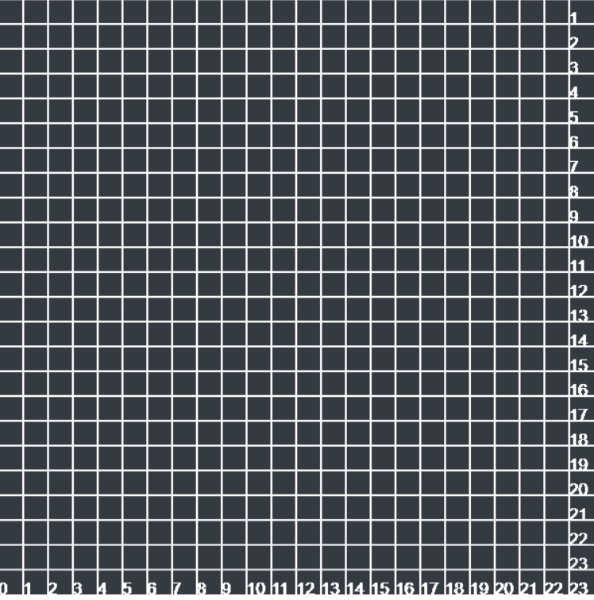

# pxShader
   
## About
pxShader is a javascript library mearnt mainly for html5/canvas interactions. 

:bulb:This library is mainly object based.
for those who don't really like reading :scissors: :books: a video tutorial is available :point_right:[](https://www.youtube.com/channel/UCnxj0bAsTa7jy35lLeAoswA/playlists?view_as=subscriber)
## Table of Contents
* __Getting Started__
     * [ Basic setup ](#setup)
     * [ The Grid System ](#grid)
* __Basic Shapes__
     * [ Drawing a Rectangle ](#rectangle)
     * [ Drawing a Circle ](#circle)
     * [ Drawing a Text ](#text)
     * [Drawing an image ](#image)
     * [ Drawing an Line ](#line)
* __Complex Shapes__
     * [ objectArray ](#objectarray)
* __More Drawing Parameters__
     * [ COLORS ](#colors)
     * [ Stroke ](#stroke)
* [__Global Variables__](#globals)
* [__More Functions__](#functions)
* __Animations__
     * [ Animate() ](#animate)
     * [ Update() ](#update)
     * [ StopAnim() ](#stopAnim)
     * [ Intersect() ](#intersect)
* [__MORE__](#more)
   ## Setup
    So we will first see what are the basic requirements to start the tutorial,
    well first you will actually need to download it and include it in your code in this way:

      <html>
         <body>
         </body>
         <!--Here is actually the link for the library-->
         <script href="pxShader.js"></script>
         <!-- Here is where you place your code-->
         <script></script>
      </html>   
  So an important thing to know when working with pxShader.js is that you are actually mainly working in a coordinate system 
  that is when drawing any thing using the library you need to specify the x and y coordinates of the object you want to draw.
  That said let's look at what we can actually put in our __empty__ script tag
  ``` javascript
      var c = canvas2d();
  ```
  The canvas2d() function initializes the drawing area or __canvas__ where you will draw all you shapes and returns the DOM object of     that canvas. So basically the variable c will contain the an object. if you are used to the __DOM (DOCUMENT OBJECT MODEL)__ in js you   can actually do funny things with it as giving it an id/class to further format it's style :smile: 
 
  so this is the basic syntax for using the library you can't draw any without calling the __canvas2d()__ funtion or you are bound to     get an error so let's look at the function and it's parameters.
  so this is the __General syntax for this : canvas2d(width,height,responsive?,centered?)__
  
  | paramters | Meaning |
  | --- | --- |
  | width |`optional`:Specifies the width of the drawing element,`default`:600px|
  | height|`optional`:Specifies the height of the drawing element,`default`:600px|
  | responsive? | `optional`:Tells whether the drawing element is media responsive or not (adapts it's size to screen size) `default`: false|
  | centered? | `optional`: Tells whether the drawing elemet is centered or not `default`: false|
 
  ## Grid 
  So basically when most of the shapes in pxShader you are likely to use a coordinate to sepcify where in the canvas you want your shape   to be drawn else it is not drawn or you recieve a *sweet error* . So how do we specify those coordinates for an object we are drawing?
  ``` javascript
      var c = canvas2d();
      var Robj =  {
         x : 20,
         y: 40,
         w : 80,
         h : 80
      }
      var rect = rec(Robj);
  ```
   So this is in someway the answer. In this code, you can see that after intializing the canvas with __canvas2d();__ method we are are creating a new variable `Robj` which is an object with attributes x and y. So generally that is always how you are going to specify the coordinates of the object you are about to draw. So this example we are going to a see it the next sections so don't worry much about the next line we are going to discuss further about it. 
   Another interesting question is to say how is the coordinate system scaled? 
   The coordinate system starts from 0 to the width of the drawing/canvas element on the x-axis and from 0 to the height of the drawing/canvas element on the y-axis.
   and well for conviency pxShader has an in-build function for drawing that coordinate system so that you can actually place the object    where you want with a bit of precision.
    ``` javascript
      var c = canvas2d();
      grid(25);// the grid () function draws a grid and takes as paramter the space between each line on the grid
      draw();// the draw method draw all shapes that have been initialized
    ```
    #### OUTPUT
     
     
     :bulb: Any  point on that grid corresponds to that point multiplied by the interval of the grid so the point (2,5) will be (50,125) when drawing your shape 
   ## Rectangle
     ### GENERAL SYNTAX
     ` rec({x:x-coord,y:y-coord,w:width,h:height});`
     ### EXAMPLE 
   ``` javascript
   var canvas = canvas2d();
   var square = rec({x:10,y:20,w:20,h:20});
   square.draw();
   ```
 So here we actually created our first shape. so the rec function initializes an object shape width a draw method and returns it      onto the the variable square so when `square.draw()` is called it actally draws the that object shape we have initialized alternatively we could just only say  `draw()` this will draw all the object shapes that have been initialized. So actually the main difference between these 2 is that the `square.draw()` will only  draw 1 shape that is specific object shape that is in the square variable that has been initialized while, the `draw()` draws all the shapes that have been initialized. 
So let's explain more the general syntax     

 | paramter | meaning |
 | ---      | ----    |
 | x  | specifies the x coordinate of the top left corner of the rectangle|
 | y  | specifes the y coordimaet of the top corner of the rectangle |
 | w  | specifies the width of the rectangle|
 |h | Specifies the height of the rectangle|
  ## Circle
   ### GENERAL SYNTAX
   ` arc({x:x-coord,y:y-coord,r:radius,deg:degrees});`
   ### EXAMPLE 
   ``` javascript
   var canvas = canvas2d();
   var circle = arc({x:10,y:20,r:20});
   circle.draw();
   ```
   So here we use the function arc to initialize a circle object shape and return it to the variable circle then call the buit-in method          `circle.draw();` that all object shapes pocess to draw the circle. So let's look at the general syntax:
   
   | paramter | meaning |
   | ---      | ----    |
   | x  | specifies the x coordinate of the center of the arc/circle|
   | y  | specifies the y coordinate of the center of the arc/circle |
   | r  | specifies the raduis of the arc/circle|
   |deg | `optinal`: Specifies the number of degrees in the arc/circle in radians, `default:2*PI`|
   
   :bulb: Setting the deg parameter only to PI will only draw half a circle.
 ## Text
   ### GENERAL SYNTAX
   `text({x:x-coord,y:y-coord,txt:text-content});`
   ### EXAMPLE  
   ``` javascript
   var canvas = canvas2d();
   var myText = text({x:10,y:20,text:"Hello world"});
   myText.draw();
   ```
   So here we use the function text to initialize a text object shape and return it to the variable myText then call the buit-in method          `myText.draw();` that all object shapes pocess to draw the text. So let's look at the general syntax:
   
   | paramter | meaning |
   | ---      | ----    |
   | x  | specifies the x coordinate of the top left corner of the text|
   | y  | specifes the y coordimaet of the top corner of the text |
   | txt  | specifies the content or the value of the text|
  
   :bulb: the text object shape (object return by the text function) has another method apart from the `draw()` method which is the        `toBox()` method and this method returns an object which contains the dimensions of the text object shape. that is:
   ``` javascript
   var canvas = canvas2d();
   var myText = text({x:10,y:20,txt:"Hello world"});
   console.log(myText.toBox());//outputs:{x: 10, y: -5, h: 30, w: 148.388671875}
   ```
   ## Image
   ### GENERAL SYNTAX
     ` img({x:x-coord,y:y-coord,src:path,h:height,w:width});`
   ### EXAMPLE  
   ``` javascript
   var canvas = canvas2d();
   var myImage = img({x:10,y:20,src:"logo.png"});
   myImage.draw();
   ```
   So here we use the function img to initialize an image object shape and return it to the variable myImage then call the buit-in method `myImage.draw();` that all object shapes pocess to draw the image. So let's look at the general syntax:
   
   | paramter | meaning |
   | ---      | ----    |
   | x  | specifies the x coordinate of the top left corner of the image|
   | y  | specifes the y coordimaet of the top corner of the image |
   | src  | specifies the url/path to the image file want to draw|
   | h | `optional`:specifies the height of the image in the canvas ,`default`:The height of the loaded image |
   | w | `optional`:specifies the width of the image in th canvas, `default`:The width of the loaded image|
   ## Line
   ### GENERAL SYNTAX
   `line({from:[x1,y1],to:[x2,y2],w:width});`
   ### EXAMPLE     
   ``` javascript
      var canvas = canvas2d();
      var myline = line({from:[10,20],to:[400,300],w:width});;
      myLine.draw();
  ```
   | paramter | meaning |
   | ---      | ----    |
   | from  | specifies the array x and y coordinate of begining point of the line `ex`:`from:[x,y]`|
   | to  | specifies the array x and y coordinate of end point of the line `ex`:`to:[x,y]` |
   | w | specifies the width of the line|   
## objectArray
   So we are actually moving into a more complex shape here remember that we've seen the basics of drawing shape well the objectArray is 
   a complex object shape formed from the variety of other simple shapes seen above. An objectArray is a cluster of basic shapes this is    a really intersting concept since it allows a variety of possibilities like drawing a car from 2 rectangles and a two circles. 
   ### GENERAL SYNTAX
      ` objArray(array);`
   ### EXAMPLE
   ``` javascript
         canvas2d();// actually this function don't need to be assigned to a variable as far as it is called
        var r1 = rec({x: 10, y: 540, w: 200, h: 40});
        var r2 = rec({x: 75, y: 510, w: 60, h: 30});
        var c1 = arc({x: 35, y: 585, r: 15});
        var c2 = arc({x: 175, y: 585, r: 15});
        var car = objArray([r1, r2, c1, c2]);
        car.draw()
   ```
  So as you can see we created two circles/arcs c1 and c2 and two rectangles r1 and  r2 which we used to create an object array in the     form of a car. So we gave all the initialized objects into `objArray()` function to create a new objectArray which is returned into     the variable car.Then we call the method present in all object Shapes which is the `draw()` method. So let's analyse the genera syntax
  
   | paramter | meaning |
   | ---      | ----    |
   | array    | Specifies an array of all the objects that make up the object array| 
   
   :bulb: objectArrays are one of the expections to the *specify coordinate rule* since it turns out they don't need any thing to          specify thier coordinates. It Intializes using the coordinates of all elements contituiting it (You will better understand as we get    to animations).
  
   ## COLORS
   for those who may already know colors are the main elements when creating drawing , games and any design scene thus important. And      since the begening of this, we've been just talking about boring stuffs and if you tried any of the codes in this tutorial you must      have realized that actually all the objects we created where in white. But from now this will change because now we are introducting
   colors :smile::tulip::dolphin: so all the basic shapes we've see from now can have thier color changed by adding an attribute color 
   to thier paramter object. that is,
   ``` javascript
        canvas2d();
        l1 =line({from:[12,30],to:[125,60],color:"red"});
        l1.draw();
   ```
   If you can recall this is the syntax we used to initialize a line object expect that in the object we are a new attribute on to the      object parameter which is simply red. So here we have now specified a color on the object which is red so you go on and do same with    other examples we've covered go on and color those shapes.
   So if you are done whith this coloring, we can actually continue.So we can color those shapes as we want with basic css                  colors("red","violet","blue","green") but pxShader has a more diverse variety of colors. It has an object called `COLORS` in which      you can find values of more that __130__ colors. so let's go on and actually use one of these in the next code.
   ``` javascript
        canvas2d();
        rec({x:300,y:200,w:30,h:50,color:COLORS.CORAL});
        arc({x:300,y:400,r:30,color:COLORS.AQUA});
        draw();
   ```
   so there will be a variety of colors in the COLORS object a if you look at the file colors.html in the repo you can actually see        all the colors in the COLORS object.
   :bulb: the colors can be replaced with numbers from __0__ to __139__ so these values corresponds to the range of colors in the          COLORS object and for each number in that range there will be a corresponding color.
   ## Stroke   
   The  Stroke parameter is very similar that of the color parameter in that it helps to bring more life and beautify the objects which    are drawn.
   Let's look at this example where it is combined with color attribute to give more life to our car from the objectArray section.
   ``` javascript
      canvas2d();
      var r1 = rec({x: 10, y: 540, w: 200, h: 40,color:COLORS.LIGHTCORAL});
      var r2 = rec({x: 75, y: 510, w: 60, h: 30,color:COLORS.LIGHTBLUE,stroke:{color:COLORS.LIGHTCORAL,width:7,coop:true}});
      var c1 = arc({x: 35, y: 585, r: 15,color:COLORS.WHITE,stroke:{color:COLORS.BLACK,width:10,coop:true}});
      var c2 = arc({x: 175, y: 585, r: 15,color:COLORS.WHITE,stroke:{color:COLORS.BLACK,width:10,coop:true}});
      var car = objArray([r1, r2, c1, c2]);
      car.draw();
   ```
   So as you can see the stroke paramter makes things look weird without necessary them being. the stroke is an object that specifies      the border of our shapes. So it's value is an object of atleast 1 attribute and atmost 4 attributes.
   so let's look at the general format for our stroke object.
   `{color:String,width:real,coop:boolean,cap:string}`
   
   | attribute | Meaning |
   | ---       | ---     |
   |color| `optional`:specifies the value of color of the border (Can take the same values as the color parameter),`default`:"black"|
   | width     |`optional`:Specifies the width of the border ,`default`:"1px"|
   |coop       |`optional`:Specifies whether the color attribute is to be used in same time width the stroke attribute,`default`:false|
   | cap       |`optional`:specifies the shape of the edge of the border in a non closed shape(line,semi-circle) `values`:"butt\|round\|square",`default`: "butt"|
   
:bulb: If the coop attribute of the stroke is not set or set to false the color attribute is eliminated when drawing the shape
 ## Globals
   Globals refer to variables that generally do not change and can be used in the code for couple of reasons
 
| Name | Type | meaning |
| ----| ------|---------|
| PI | Number| contains the value of PI(22/7)|
| E  |Number | contains the value of the base of ln (euler's number)|
|WIDTH|Number| contains the width of the canvas element we are drawing on|
|HEIGHT|Number|contains the height of the canvas element we are drawing on|
|TRANS_STAT|Array|contains an array of the values last transfromation done using transate() `ie`[x-coordinate,y-coordinate]|
|SCALE_STAT|Array |contains an array of the values last scale done on canvas using scale() `ie`[x-scale,y-scale]|
|ROT_STAT | Number|contains the value of last rotation done on canvas using rotate() |
|KEY_P | String | contains the string value for the keyboard key being pressed |
|KEY_U| String | contains the string value for the keyboard key being released |
|MP_X | Number |  contains the x-coordinate of the mouse in the canvas/drawing element|
|MP_Y | Number|   contains the y-coordinate of the mouse in the canvas/drawing element|
| CLICK | Boolean| is true when mouse has been clicked|
|DB_CLICK| Boolean| is true when mouse has been  double clicked|
 ## Functions
| function | parameters | meaning | example |
| ---      | ----       | --------|-------- | 
|background|`number`:2,`types`:String|Sets the background color of the canvas/drawing element(:bulb:Takes same value as color or stroke attributes)|`background(COLORS.GRAY);`|
| clear    |`none`|Clears all Shapes that have been drawn on the canvas element|`clear()`|
| translate|`number`:2,`types`:Number|Sets the begining point of drawing to the paramters of drawing `ie` if the parameters are 50,100 when drawing a shape at x:0,y:0 the shape will instead be drawn at x:50,y:100|`translate(300,200)`|
| transparency|`number`:1,`type`:Number|Sets the overrall transparency of each shape parameter value ranges from 0(invisible) to 1(Not transparent) |`transparency(0.7)`|
| rotate|`number`:1,`type`:Number|Rotates a shape by the angle in radians specified in the parameter|`rotate(PI/2)`|
| scale|`number`:2,`types`:Number|Scales the canvas drawing in the ratio of paramter 1 as x is to parameter 2 as y `ie`executing scale(2,1) and drawing a circle will make the circle oval since the ratio of the x to the y-axis is 2:1|`scale(2,1)`|
| save|`none`|Saves all previous transformation like rotate,translate,scale done on the canvas|`save()`|
| restore|`none`|Saves all previous saved transformation |`restore()`|          |
| eraseShape|`number`:1 or `none`,`type`:Object| erase a shape from the drawing context such that on calling draw() function it is not longer drawn.:bulb:If no value is given to it.removes all previously initialized shapes|`eraseShape(rectangle)`|
| copyObj |`number`:1,`type`:Object|Takes every attributes of an object copies it and returns it| `var copied = copyObj({x:10,y:30});`       |
| dist |`number`:2 or 1,`type`:(Object )|Calculates the distance between two objects that has x and y attributes:bulb: if ONLY 1 object is passed to the dist function it actually calculates it's magnitude. |`dist(rectangle,circle)`|
| toPoints |`number`:2 or 1,`type`:Object and Number|changes an object shape into an array of points with x and y attributes the second parameter sepcifies the distance between the points which is 7 by `default`|`toPoints(circle,15)`|
| ceil |`number`:1,`type`:Number|rounds up the parameter to nearest whole number and returns it|`var n =ceil(5.1)//n is 6`|
| floor |`number`:1,`type`:Number|rounds down the parameter to nearest whole number and returns it|`var n=floor(5.1)//n is 5`|
| rand |`number`:2,`types`:Number|returns a random number in the range the first parameter to the second parameter|`var n =rand(2,6)// n is 5`|
| abs |`number`:1,`type`:Number|Finds the absolute value of the paramter and returns it|`var n =abs(-5)//n is 5`|
| max |`number`:2,`types`:Number|Finds the maximum value between the two paramters and returns it|`var n = max(5.1,5.5//n is 5.5`|
| min |`number`:2,`types`:Number|Finds the minimum value between the two paramters and returns it|`var n = min(5.1,5.5//n is 5.1`|      
| sin |`number`:1,`type`:Number|Returns the sin of the radians angle given in the parameter|`var n = sin(PI/6)//n is ~0.5`      |
| cos |`number`:1,`type`:Number|Returns the cos of the radians angle given in the parameter|      |
| tan |`number`:1,`type`:Number|Returns the tan of the radians angle given in the parameter|      |
| sinh |`number`:1,`type`:Number|Returns the sinh of the radians angle given in the parameter|      |
| cosh |`number`:1,`type`:Number|Returns the cosh of the radians angle given in the parameter|      |
| tanh |`number`:1,`type`:Number|Returns the tanh of the radians angle given in the parameter|      |
| asin |`number`:1,`type`:Number|Returns the asin of the radians angle given in the parameter|      |
| acos |`number`:1,`type`:Number|Returns the acos of the radians angle given in the parameter|      |
| atan |`number`:1,`type`:Number|Returns the atan of the radians angle given in the parameter|      |
| asinh |`number`:1,`type`:Number|Returns the asinh of the radians angle given in the parameter|      |
| acosh |`number`:1,`type`:Number|Returns the acosh of the radians angle given in the parameter|      |
| atanh |`number`:1,`type`:Number|Returns the atanh of the radians angle given in the parameter|      |
| sqrt |`number`:1,`type`:Number|Returns the square root of the given parameter| `var n=sqrt(4)// n is 2`     |
| exp |`number`:1,`types`:Numbers|Returns the the E to the power of the paramter | `var n=exp(4)// n is 54.59`    |
| ln |`number`:1,`type`:Number|Returns the natural logarith of the parameter|`var n=exp(54.6)// n ~ 4`|
| pow |`number`:2,`types`:Number|Returns the first parameter to the power of the second|`var n=pow(4,3)// n is 6#4`|
## Animate
   Animate is one of the principal methods used in animations in pxShader.js .So this method has 2 arguments. so animations are            generally created by changing object properties slighly in the callback function of the animate function.
   ### GENERAL SYNTAX
   `animate(callback,interval);`
   
  | parameter | meaning |
  |-----------|----------|
  |callback   | The callback function is a functions that will be used to create the animation effect|
  | interval  | `optional`:It is the number of times per second you will call the callback to make the animation(:it may not exceed 60:),`default`:60|
   ### EXAMPLE
   So let's actually do our first animation
  ``` javascript
      canvas2d();
      var circle = arc({x:10,y:HEIGHT-10,r:10,color:COLORS.RED});// remember that HEIGHT is the value height of the canvas we subtract the raduis if the circle(10) so that it is at the bottom 
      animate(function(){
         circle.x+=2;//this increments the value of the coordinate x of the circle by 2 each the animate loop.
      })
 ```    
   What you will see is a red circle moving from left to right on the bottom of the canvas. So the same trick could be used insteaad by substracting the property y so it it moves upward. Well the animate uses the draw() function to draw so will draw all the object shapes    that have been initialized so care must be taken using it.So if you are using animate, __DONOT FORGET TO ERASE THE SHAPES THAT AREN'T BEING USED IN THE ANIMATION__; This could be achieved by using the `eraseShapes` function thus `eraseShape(circle);` doing this, the circle will not longer be drawn when using the draw() function and thus not drawn in the animation.
   So let's look at more examples
 ``` javascript
      canvas2d();
      var circle = arc({x:WIDTH/2,y:HEIGHT/2,r:10,color:COLORS.RED});// using WIDTH/2 and HEIGHT/2 as y and x coordinates respectively          will make it stand at the center of the canvas
      animate(function(){
         circle.r+=2;//this increments the value of the raduis of the circle by 2 each the animate loop.
      })
```
   If you try this you will see the red circle instead growing until it fills the canvas completely. So one thing to know about pxShader     is that the properties inputted in the object parameter when initializing a shape are also given to the initialized shapes thus can     be changed during the animation.eg.You could change the color attribute of the circle to be a random number between 0 and 139  to       change it's color.
   You could as well change the `txt` or it's font property of a text object shape during the animation.
   You could change the `w` or `h` attributes of a rectangle during an animation.
   You can as well extend a line by increment the values of the array in the  `to` property during an animtion.
   You also make the `to` property of the line to be an array containing `[MP_X,MP_Y]` so that it extends following the mouse direction.
   __THERE are may possiblities that we shall explore in the video tutorial__
   :bulb: Extra attributes can be used when initializing the object shape without any error or effect in the code and those will be owned by the object shape created.
   example:
   ``` javascript
      canvas2d();
      var circle = arc({x:WIDTH/2,y:HEIGHT/2,r:10,color:COLORS.RED,lives:5});
      console.log(circle.lives)//this will give us 5
   ```
 ## Update
   The update function is also very used in animations using pxShader.js the only difference from the update function is  that each time when using this function you must clear the previous object drawn on the canavas using the `clear()` function and draw them back. So this method so the problem main problem in the animate function since here we have to draw the objects we want to animate by our selves and thus only objects that had to be drawn are drawn without erasing the shapes with the eraseShape.
   Let's look at the Syntax.
   ### GENERAL SYNTAX
   `update(callback,interval);`
   
  | parameter | meaning |
  |-----------|----------|
  |callback   | The callback function is a functions that will be used to create the animation effect|
  | interval  | `optional`:It is the number of times per second you will call the callback to make the animation(:it may not exceed 60:),`default`:60|
  
  They are actually the same parameters as those of the animate.
  Let's look at an example using this function
  ``` javascript
      canvas2d();
      var circle1 = arc({x:10,y:HEIGHT-10,r:10,color:COLORS.RED});
      var circle = arc({x:10,y:HEIGHT-10,r:10,color:COLORS.RED});
      update(function(){
         clear();
       circle.x+=2;//this increments the value of the coordinate x of the circle by 2 each the animate loop.
       circle.draw()
      })
 ```
 Here the object shape `circle1` is not drawn since in the update function we only draw 1 circle.
 :bulb: if the `clear()` function is not used the previously drawn shapes will still be seen on the canvas.
## StopAnim
   `stopAnim` is a simple function that is called without any paramter has stops the current animation in launched using either the `animate` or the `update` functions.
   ### EXAMPLE
   ``` javascript
      canvas2d();
      var circle1 = arc({x:10,y:HEIGHT-10,r:10,color:COLORS.RED});
      var circle = arc({x:10,y:HEIGHT-10,r:10,color:COLORS.RED});
      update(function(){
         clear();
       circle.x+=2;//this increments the value of the coordinate x of the circle by 2 each the animate loop.
       if(circle.x+circle.r>WIDTH){
         stopAnim();
       }
       circle.draw()
      })
 ```
 So if you try this you will see that the animating circle stops at a point that is when it touches the end of the canvas element. So in the code we compare if the x coordinate of the left edge of the circle is greater that the width of the canvas and if it is true we stop the animation.
 
 ## Intersect
   Intersect function checks if an object shape touches another and returns true or false value.
   ``` javascript
        canvas2d();
        var a = arc({x:40,y:100,r:5}); 
        var b = arc({x:240,y:350,r:10});
         console.log(intersect(a,b));//outputs false
   ```
   intersect function can also be used in another way. If it is given only 1 parameter and the parameter is an array, then it checks whether the coordinates in the array are in the last drawn shape then returns a boolean.
 ``` javascript
        canvas2d();
        var a = arc({x:40,y:100,r:10});
        a.draw();
       console.log(intersect([40,100]));//outputs true
 ```
  __let's make things interesting:__
  ``` javascript
        canvas2d();
        var a = arc({x:40,y:100,r:10});
        var b = arc({x:240,y:350,r:10});
        animate(function(){
              a.x =MP_X; // assigning x coordinate to of circe a to x mouse position
              a.y =MP_Y; // assigning y coordinate to of circe a to y mouse position
              if(intersect(a,b)){
                  a.color = COLORS.CORAL;
              }else{
                  a.color = COLORS.WHITE;
              }
        })
  ```
   This will make circle a to follow the mouseand when circle a touches circle b it changes color.
   
   :bulb: `intersect` donot work on image object shapes so comparing whether an image is colliding a rectangle for example can't be done   But you can compare whether the a shape resembling that image with same dimensions and coordinates collide that rectangle :smile:.If it does then the image also does
   ## More
   Concepts such as `Pixel Manipulation` , `animations`,paths with sprites and ___More Examples___ can be found in the video tutorials :point_right:[](https://www.youtube.com/channel/UCnxj0bAsTa7jy35lLeAoswA/playlists?view_as=subscriber)
     
 
